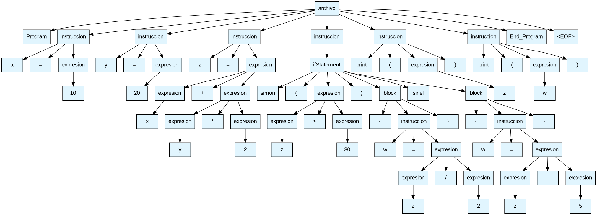

# 🧮 Proyecto Compiladores — *Lenguaje Personalizado con ANTLR4*

> Intérprete / compilador híbrido de un lenguaje personalizado construido con **ANTLR4 + Python 3**.
> Soporta expresiones aritméticas, lógicas, variables tipadas, condicionales, ciclos, funciones, imports y bloques de código.

[](https://www.python.org/)
[](https://www.antlr.org/)
[](https://github.com/teddysxdxd/Proyecto_compiladores/tree/desarrollo)
[](LICENSE)

---

## 📋 Tabla de Contenidos

* [¿Qué es este proyecto?](#-qué-es-este-proyecto)
* [Características del lenguaje](#-características-del-lenguaje)
* [Estructura del proyecto](#-estructura-del-proyecto)
* [Requisitos previos](#-requisitos-previos)
* [Instalación y ejecución](#-instalación-y-ejecución)
* [Sintaxis del lenguaje](#-sintaxis-del-lenguaje)
* [Ejemplos de uso](#-ejemplos-de-uso)
* [Gramática (resumen)](#-gramática-resumen)
* [Colaboradores](#-colaboradores)

---

## 🔍 ¿Qué es este proyecto?

Este proyecto implementa un **intérprete** para un lenguaje de programación personalizado usando el generador de parsers **ANTLR4** con runtime de Python.  
El lenguaje soporta operaciones matemáticas, comparaciones, lógica booleana, variables, estructuras condicionales (`simon` / `sinel`) y bloques de código.

---
## 🌳 Visualización del AST
El proyecto utiliza **Graphviz** para generar una representación visual de la estructura jerárquica del código fuente. Esto facilita la depuración de la gramática y el análisis de la precedencia de operadores.



## 🚀 Novedades del Proyecto 2

El proyecto evolucionó a un modelo más cercano a un compilador formal:

### 🔄 Pipeline de Ejecución
Se implementó un flujo obligatorio de validación:

```
Léxico → Sintáctico → Semántico → Intérprete
```

Esto garantiza que el código sea válido antes de ejecutarse.

### 🧠 Análisis Semántico
- Validación de tipos
- Verificación de variables declaradas
- Validación de funciones (parámetros y retorno)

### 🗂️ Manejo de Scopes (Ámbitos)
- Implementado con **pila de tablas hash (dicts en Python)**
- Soporta:
  - Scope global
  - Scopes locales (funciones y bloques)
- Acceso eficiente en tiempo **O(1)**

### 🔁 Funciones
- Declaración con parámetros tipados
- Retorno obligatorio
- Soporte para **recursividad**

### ❌ Manejo de Errores
- Errores léxicos, sintácticos y semánticos
- Reporte detallado con línea y columna
- Implementado en `custom_errors.py`
# Ejemplo de salida ante un error semántico:
[ERROR SEMÁNTICO] Línea 5:12 - La variable 'resultado' ya ha sido declarada en este ámbito.
[ERROR DE TIPOS] Línea 8:05 - No se puede sumar 'INT' con 'BOOL'.

---

## ✨ Características del lenguaje

| Categoría        | Operadores / Palabras clave             |
| ---------------- | --------------------------------------- |
| Tipos            | `int` `float` `string` `bool` `void`    |
| Aritméticos      | `+` `-` `*` `/` `%`                     |
| Relacionales     | `==` `!=` `<>` `<` `>` `<=` `>=`        |
| Lógicos          | `&&` `\|\|` `!`                         |
| Asignación       | `=`                                     |
| Condicional      | `simon ( condición ) { }` / `sinel { }` |
| Ciclos           | `while (...) { }` / `for (...) { }`     |
| Funciones        | declaración, parámetros y `return`      |
| Control de flujo | `break` / `continue`                    |
| Imports          | `import modulo`                         |
| I/O              | `print( expresión )`                    |
| Delimitadores    | `Program` … `End_Program`               |

---

## 📁 Estructura del proyecto

```text
Proyecto_compiladores/
│
├── .antlr/                 # Archivos temporales de ANTLR
├── src/                    # Casos de prueba y programas fuente del lenguaje
│   ├── modulo.txt
│   ├── while.txt
│   ├── operaciones.txt
│   └── ...
├── venv/                   # Entorno virtual de Python
├── gramatica_v4.g4          # Gramática principal (Lexer + Parser)
├── compiler.py             # Script principal del compilador
├── interpreter_visitor.py  # Lógica del intérprete (Visitor)
├── semantic_visitor.py     # Verificación de reglas semánticas
├── symbol_table.py         # Gestión de tabla de símbolos
├── custom_errors.py        # Manejo de errores personalizados
├── pipeline.py             # Flujo de ejecución del proyecto
├── arbol_ast.png           # Visualización del árbol generado
├── ir_generator.py         # Traduce el módulo a LLVM IR
├── ui_compiler.py          # Interfaz gráfica de compilación
├── tac_generator.py        # Recorre el AST generado y emite código en tres direcciones
├── readme.md               # Documentación del proyecto
└── .gitignore              # Archivos excluidos de Git
```

> ⚙️ Al ejecutar `antlr4`, se generan automáticamente los siguientes archivos (no subir al repo):
> `gramatica_v4Lexer.py`, `gramatica_v4Parser.py`, `gramatica_v4Visitor.py`, `gramatica_v4Listener.py`, `operaciones.ll`, `operaciones.tac`

---

## 🔧 Requisitos previos

Antes de correr el proyecto, asegúrate de tener instalado:

* **Python 3.8+** → [descargar](https://www.python.org/downloads/)
* **Java 11+** (necesario para ANTLR4) → [descargar](https://adoptium.net/)
* **ANTLR4 CLI** → [instrucciones de instalación](https://www.antlr.org/download.html)

Para verificar que tienes todo:

```bash
python3 --version   # Python 3.8+
java --version      # Java 11+
antlr4              # Debe mostrar la versión de ANTLR
```

---

## 🚀 Instalación y ejecución

### Paso 1 — Clonar el repositorio

```bash
git clone https://github.com/teddysxdxd/Proyecto_compiladores.git
cd Proyecto_compiladores
git checkout desarrollo
```

### Paso 2 — Crear y activar el entorno virtual

```bash
# Crear entorno virtual
python3 -m venv venv

# Activar (Linux / macOS)
source venv/bin/activate
```

> 💡 Sabrás que está activo cuando el prompt muestre `(venv)` al inicio.

### Paso 3 — Instalar dependencias

```bash
pip install antlr4-python3-runtime
pip install llvmlite
pip install textual
pip install rich
sudo apt install mingw-w64
```

### Paso 4 — Generar el parser desde la gramática

```bash
antlr4 -Dlanguage=Python3 -visitor -no-listener gramatica_v4.g4
```

Esto genera los archivos `gramatica_v4Lexer.py`, `gramatica_v4Parser.py`, etc.

## Paso 5 - Instalar dependencias de Graphviz

```bash
sudo apt install graphviz
```

Esto generará dos archivos llamados `arbol.dot` y `arbol_ast.png`.

## Paso 6 - Instalación de Tkinter

```bash
sudo apt install python3-tk
```

### Paso 7 — Correr el intérprete

```bash
python3 pipeline.py
```

### Paso 8 — Vista de interfaz

```bash
1. Abrir interfaz gráfica
2. Seleccionar archivo fuente (.txt)
3. Presionar "Compilar"
4. Ejecutar pipeline de compilación
5. Mostrar resultados / errores
6. Cerrar aplicación

python3 ui_compiler.py

ui_compiler.py
└── Interfaz gráfica del compilador para carga de archivos,
    ejecución del pipeline y visualización de resultados
```

---

## 📝 Sintaxis del lenguaje

Todo programa debe comenzar con `Program` y terminar con `End_Program`.

### Estructura básica

```txt
Program
    # tu código aquí
End_Program
```

### Variables y expresiones

```txt
Program
    int x = 10
    float y = 3.5
    float resultado = x + y * 2
    print(resultado)
End_Program
```

### Condicional — `simon` / `sinel`

> La palabra clave `simon` equivale a `if`, y `sinel` equivale a `else`.

```txt
Program
    int x = 15
    simon (x > 10) {
        print("x es mayor que 10")
    } sinel {
        print("x es menor o igual a 10")
    }
End_Program
```

### Operadores lógicos

```txt
Program
    bool activo = true
    simon (activo && true) {
        print("condicion verdadera")
    }
End_Program
```

### Ciclo while

```txt
Program
    int i = 0

    while (i < 5) {
        print(i)
        i = i + 1
    }
End_Program
```

### Ciclo for

```txt
Program
    int i = 0

    for(i = 0; i < 10; i = i + 1) {
        print(i)
    }
End_Program
```

### Declaración de funciones

```txt
Program

int suma(int a, int b){
    return a + b
}

print(suma(4,6))

End_Program
```

### Imports

```txt
import math

Program
    print(math.sqrt(25))
End_Program
```

### Break / Continue

```txt
Program
    while (true) {
        break
    }
End_Program
```

### Sección Tipos

| Tipo   | Descripción | Ejemplo                    |
| ------ | ----------- | -------------------------- |
| int    | entero      | `int edad = 20`            |
| float  | decimal     | `float pi = 3.14`          |
| string | texto       | `string nombre = "Nombre"` |
| bool   | booleano    | `bool activo = true`       |

## 💡 Ejemplos de uso

<details>
<summary><strong>Ejemplo 1 — Operaciones aritméticas básicas</strong></summary>

```txt
Program
    print(5 + 3)
    print(10 / 2)
    print(7 * (2 + 1))
End_Program
```

**Salida esperada:**

```txt
8
5.0
21
```

</details>

<details>
<summary><strong>Ejemplo 2 — Variables y comparaciones</strong></summary>

```txt
Program
    int edad = 20
    simon (edad >= 18) {
        print("Mayor de edad")
    } sinel {
        print("Menor de edad")
    }
End_Program
```

**Salida esperada:**

```txt
Mayor de edad
```

</details>

<details>
<summary><strong>Ejemplo 3 — Operadores lógicos y negación</strong></summary>

```txt
Program
    bool activo = false
    simon (!activo) {
        print("inactivo")
    } sinel {
        print("activo")
    }
End_Program
```

</details>

---

> 📂 El directorio `src/` contiene todos los **casos de prueba** del compilador,
> incluyendo programas válidos, pruebas de operadores, estructuras condicionales,
> validaciones semánticas y escenarios de error utilizados para verificar
> el correcto funcionamiento del lenguaje.

```text
├── src/                    # Casos de prueba y programas fuente del lenguaje
│   ├── modulo.txt
│   ├── while.txt
│   ├── operaciones.txt
│   └── ...
```

## 📐 Gramática (resumen)

El lenguaje es definido en `gramatica_v4.g4`. Su estructura principal:

```txt
archivo → importStatement* INICIOPROGRAMA instruccion* FINPROGRAMA
instruccion → declaracion | asignacion | print | if | while | for | return | funcion | break | continue | bloque | expresion
ifStatement → simon ( expresión ) bloque ( sinel bloque )?
whileStatement → while ( expresión ) bloque
forStatement → for ( asignacion ; expresión ; asignacion ) bloque
expresion → número | cadena | booleano | variable | llamadaFuncion | llamadaModulo | operación aritmética | operación lógica
```

<details>
<summary><strong>Ver gramática completa</strong></summary>

```antlr
(Coloca aquí la gramática completa actualizada de gramatica_v4.g4)
```


</details>
